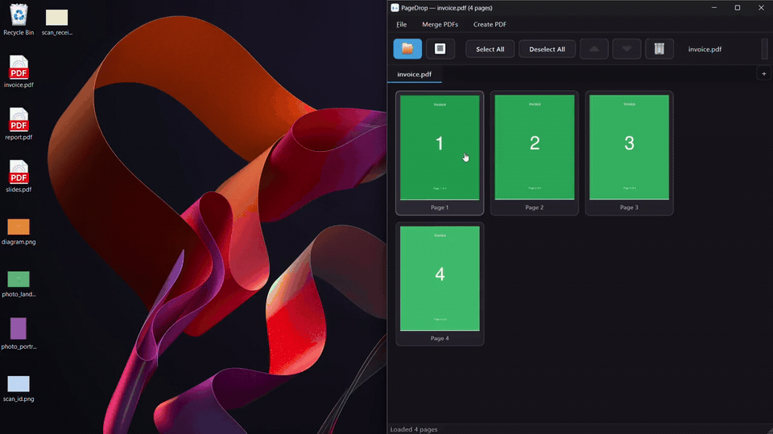
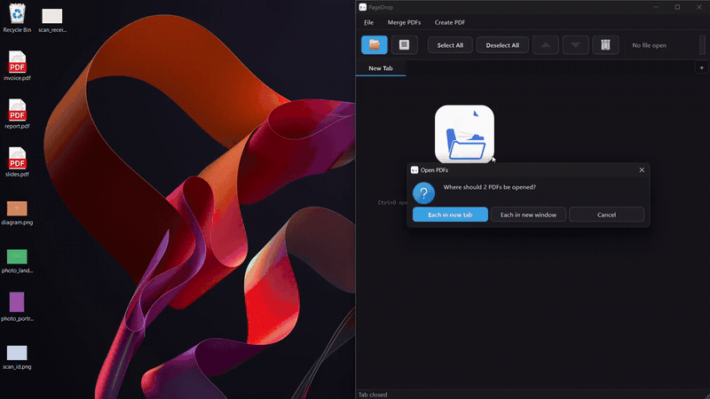
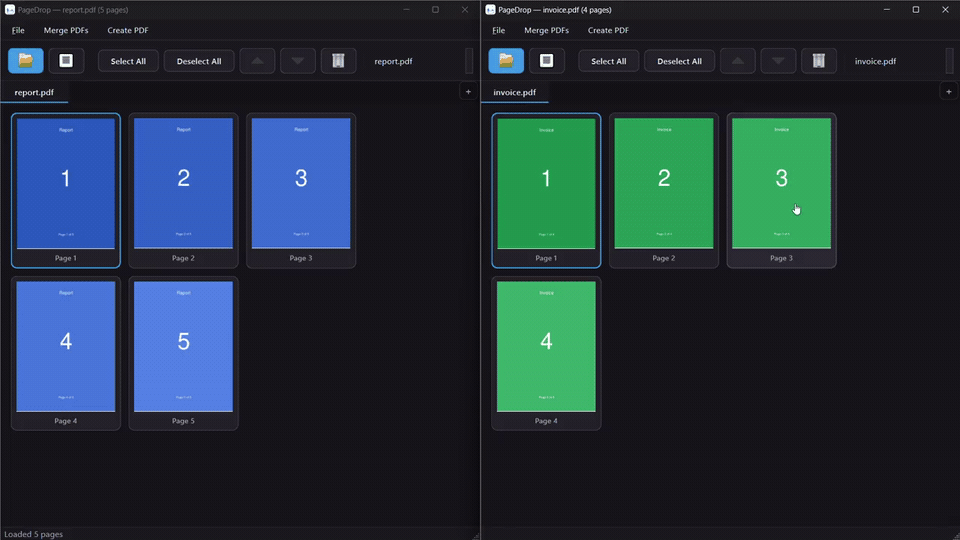
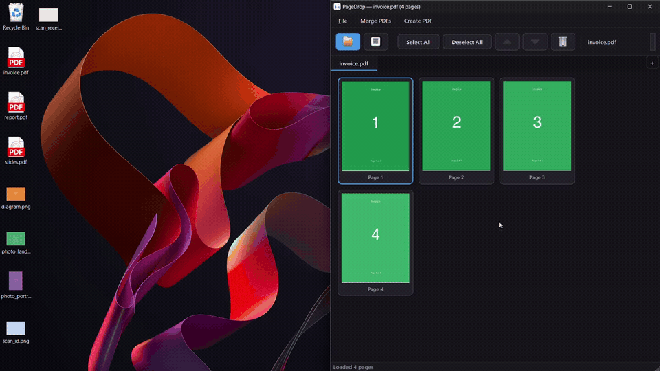

<p align="center">
  
</p>

# PageDrop

A free, open-source PDF desktop app built for people who actually organize documents — pulling pages from one PDF into another, reordering, merging, and dragging pages straight into your file manager.

Adobe is expensive. Cracked tools aren’t worth the risk. Most free PDF apps get the job done but feel clunky. PageDrop is the opposite: a clean thumbnail grid, browser-style tabs, and drag-and-drop workflows designed around real multi-PDF editing — not just viewing a single file.

## See it in action

### Drag pages to your file manager

Select thumbnails and drop them into Explorer, Finder, or any file manager — each page becomes its own PDF.



### Multi-tab editing

Reorder pages, insert another PDF, delete pages, and **Save As** without overwriting the original.



### Cross-window page transfer

Copy pages between windows, or hold **Shift** while dropping to move them from one document to another.



### Drop a PDF onto the grid

Drag a PDF from your file manager onto the thumbnail grid to insert its pages at the cursor position.



## Download

**Microsoft Store** — install from the [Microsoft Store listing](https://apps.microsoft.com/detail/9PBS1QFP36C0).

**Windows (GitHub Releases)** — no Python required:

1. Go to [**Releases**](https://github.com/ParallaX07/PageDrop/releases) and download the latest `PageDrop-*-Setup.exe` installer (or the `PageDrop-v*-windows-x64.zip` portable zip).
2. Run the Setup.exe and follow the wizard (installs to Program Files, Start Menu shortcut).
3. Or extract the zip and keep `pagedrop.exe` next to its `_internal\` folder, then double-click `pagedrop.exe`.

> Windows may show a SmartScreen warning on unsigned builds. Choose **More info → Run anyway** if prompted.

macOS and Linux binaries are not published yet — run from source (below) or build your own with PyInstaller.

## Quick start

1. **Open a PDF** — File → Open PDF (`Ctrl+O`), or the toolbar Open button. Password-protected PDFs prompt for a password. Select multiple files to open each in its own tab; **File → Open Recent** reopens recent paths.
2. **Select pages** — click one; Ctrl+click to toggle; Shift+click for a range; Ctrl+A for all. Jump with **Ctrl+G** (page) or **Ctrl+F** (page or range like `1-5`).
3. **Drag to a folder** — drag selected thumbnails into Explorer, Finder, or any file manager. Each page becomes its own PDF (e.g. `report_page_0003.pdf`).
4. **Edit across PDFs** — reorder, delete, duplicate (`Ctrl+D`), or rotate pages; drop another PDF onto the grid to insert pages; drag pages between windows (Shift+drop to move); undo with `Ctrl+Z`. Then **File → Save As**.
5. **Merge or convert** — **Merge PDFs** combines whole files; **Create PDF** turns images into PDFs.

First launch shows short tips. Press **Ctrl+/** for the full shortcut list, or **Ctrl+Shift+P** for the command palette.

## Features

### Thumbnail grid and drag-out

- Open one or more PDFs and view every page as a scrollable thumbnail grid
- **Drag pages to Explorer, Finder, Nautilus, Dolphin, etc.** — selected pages are extracted as individual PDF files
- Select pages with click, Ctrl+click, Shift+click, or Ctrl+A
- Zoom thumbnails (`Ctrl+scroll`, `Ctrl+0` to reset), double-click or Enter for full-page preview, and use arrow keys + Space for keyboard navigation
- Right-click **Extract selected pages to folder…**, or extract selection to a **new tab** / **new window**
- **File → Export All Pages…** writes every page as its own PDF

### Multi-tab editor

- Browser-style tabs — multiple PDFs open at once, each in its own workspace
- **Reorder** pages via internal drag-and-drop or Move up / Move down
- **Delete**, **duplicate**, and **rotate** pages (toolbar, context menu, or shortcuts)
- **Undo / redo** page edits (`Ctrl+Z` / `Ctrl+Shift+Z`); deleting many pages can prompt for confirmation (Preferences)
- **Drop PDFs onto the grid** (including a blank tab) to open or insert pages at the cursor
- **Save As** writes your edited document to a new file — the original is never overwritten
- Dirty tabs show a `*` in the tab title; closing prompts Save As / Discard / Cancel
- Window size/position is restored on launch; toasts confirm saves, extracts, and similar actions

### Multi-window workflows

- Open PDFs in new windows, tear tabs off the tab bar, or use **File → New Window**
- **Drag pages between windows** — default is copy; hold **Shift** while dropping to move pages from one document to another (a short Undo toast appears after a move)
- Merge PDFs and Create PDF windows can stay open alongside editor windows

### Merge PDFs

A separate window (**Merge PDFs** in the menu bar) for combining whole PDF files:

- Add, remove, and reorder files (drag-and-drop supported)
- **Add folder…** recursively adds PDFs from a directory
- Double-click or Enter a file to preview all its pages
- **Merge…** saves one combined PDF; source files are left unchanged

### Create PDF

A separate window (**Create PDF** in the menu bar) for turning images into PDFs:

- Supported formats: PNG, JPEG, BMP, GIF, TIFF, WebP, and other raster images PyMuPDF can open
- Add images via dialog or drag-and-drop (PDFs are rejected — use Merge PDFs for those)
- Export as **one combined PDF** (one page per image) or **separate PDFs** (one file per image)
- Reorder images before exporting; double-click or Enter for full-size preview (Ctrl+scroll zoom)

### Preferences and accessibility

- **View → Toggle Light Theme**; **View → Thumbnail quality** (Low / Medium / High); last thumbnail zoom is remembered
- **Edit** toggles for confirm-before-deleting-multiple-pages, confirm-before-closing-dirty-tabs, and remember window size/position
- High-contrast and reduce-motion preferences are respected where the platform exposes them
- Keyboard-first use across main, Merge, and Create toolbars and grids; Help → Keyboard Shortcuts (`Ctrl+/`)

## Keyboard shortcuts

| Action | Shortcut |
|---|---|
| Open PDF | Ctrl+O |
| Save As | Ctrl+Shift+S |
| New window | Ctrl+Shift+N |
| New tab | Ctrl+T |
| Close tab | Ctrl+W |
| Previous tab (MRU) / cycle backward | Ctrl+Tab / Ctrl+Shift+Tab |
| Select all pages | Ctrl+A |
| Clear selection | Escape |
| Delete selected pages | Delete |
| Duplicate selected pages | Ctrl+D |
| Move pages up / down | Ctrl+↑ / Ctrl+↓ |
| Undo / redo | Ctrl+Z / Ctrl+Shift+Z |
| Go to page | Ctrl+G |
| Select page / range | Ctrl+F |
| Reset zoom / fit width *(preview)* | Ctrl+0 |
| Thumbnail zoom | Ctrl+scroll |
| Preview focused page | Enter |
| Command palette | Ctrl+Shift+P |
| Keyboard shortcuts | Ctrl+/ |
| Back to grid / list | Escape *(in preview)* |

`Ctrl+Tab` toggles the most recently used previous tab (not sequential next). `Ctrl+Shift+Tab` cycles backward through all tabs.

Cross-window page drag: drop to **copy**; **Shift+drop** to **move**.

## Run from source

For development or platforms without a published binary.

**Requirements:** Python **3.11+** and [uv](https://docs.astral.sh/uv/).

```bash
git clone https://github.com/ParallaX07/PageDrop.git
cd PageDrop
uv sync
uv run pagedrop
```

No manual virtualenv activation is needed — `uv` handles the environment.

## Development

### Project layout

```
src/pagedrop/
├── main.py              # entry point
├── ui/                  # PyQt6 windows, tabs, grids, merge/convert windows
├── core/                # PDF loading, editing model, merge/convert writers
└── utils/               # temp file lifecycle
tests/                   # unit, UI, and smoke tests
```

### Tech stack

| Role | Library |
|---|---|
| GUI + drag-and-drop | PyQt6 |
| PDF read/write/split/render | PyMuPDF (fitz) |
| Project manager | uv |

PyQt6 is used for drag-and-drop because it supports `QDrag` with `file://` URLs — the protocol file managers expect when accepting dropped files.

### Tests

Run the full suite:

```bash
uv run pytest tests/ -v
```

Smoke tests only:

```bash
uv run pytest tests/smoke/ -v
```

Or use the Makefile:

```bash
make test        # all tests via all_tests.py
make test-phase4 # cumulative gate through a specific phase
```

Test fixtures are generated on the fly — see `tests/fixtures/README.md` for details.

### Building an executable

Install dev dependencies (includes PyInstaller), then build:

```bash
uv sync --group dev
uv run pyinstaller --noconfirm pagedrop.spec
```

The onedir bundle is written to `dist/pagedrop/` — launch `dist/pagedrop/pagedrop` (Linux/macOS) or `dist/pagedrop/pagedrop.exe` (Windows).

Smoke-test the build (builds first unless `--skip-build` / `-SkipBuild`):

```bash
# Linux/macOS
./scripts/smoke_exe.sh

# Windows
.\scripts\smoke_exe.ps1
```

Or via Makefile:

```bash
make build-exe
make smoke-exe          # Unix smoke script
make test-release       # full pytest gate + exe smoke (set PAGEDROP_EXE if needed)
```

### Windows installer (GitHub Releases)

Version is read from `pyproject.toml`. Generate icons once (or after logo changes), then build the Inno Setup installer ([Inno Setup 6+](https://jrsoftware.org/isinfo.php), `iscc` on PATH or `$env:ISCC`):

```powershell
uv run --with pillow python scripts/generate_icons.py   # or: make generate-icons
.\scripts\build_windows_installer.ps1                   # or: make build-installer
# reuse existing dist: .\scripts\build_windows_installer.ps1 -SkipBuild
uv run python scripts/check_packaging.py
```

Output: `installer/Output/PageDrop-<version>-Setup.exe` (gitignored — do not commit binaries).

Publish to GitHub Releases (replace `X.Y.Z` with the `pyproject.toml` version):

```powershell
gh release create "vX.Y.Z" `
  "installer/Output/PageDrop-X.Y.Z-Setup.exe" `
  --repo ParallaX07/PageDrop `
  --title "vX.Y.Z" `
  --notes "Windows Setup.exe for PageDrop X.Y.Z."
```

Optionally attach a portable zip of `dist/pagedrop/` as `PageDrop-vX.Y.Z-windows-x64.zip` on the same release.

Before tagging a release, run the full suite plus the executable smoke test:

```bash
uv run pytest tests/ -v --ignore=tests/smoke/test_phase16_executable.py
PAGEDROP_EXE=./dist/pagedrop/pagedrop uv run pytest tests/smoke/test_phase16_executable.py -v
```

On Windows PowerShell, set `$env:PAGEDROP_EXE = ".\dist\pagedrop\pagedrop.exe"` instead of `PAGEDROP_EXE=...`.

Verify manually on a machine **without Python**: open a PDF, drag a page into the file manager, and confirm extracted files appear.

## Status

**v0.3.0** — Windows Setup.exe and portable zip for [Releases](https://github.com/ParallaX07/PageDrop/releases). Builds on 0.2.0 core workflows with password-protected PDFs, page rotate/duplicate, undo/redo, export-all pages, command palette, onboarding tips, recent files, window geometry persistence, toast notifications, light theme, and accessibility / reduce-motion preferences. macOS/Linux release binaries and Authenticode signing for the Inno installer are planned.
